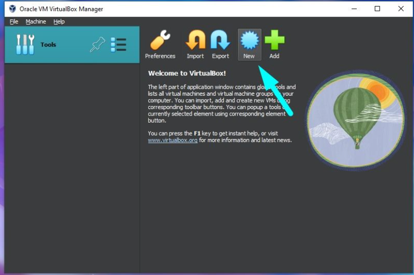
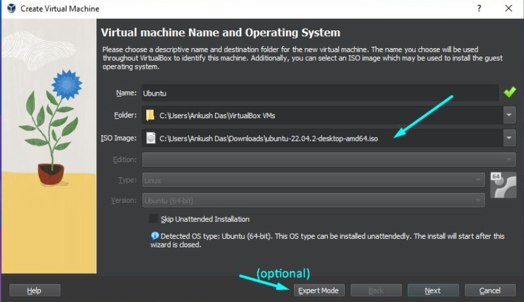
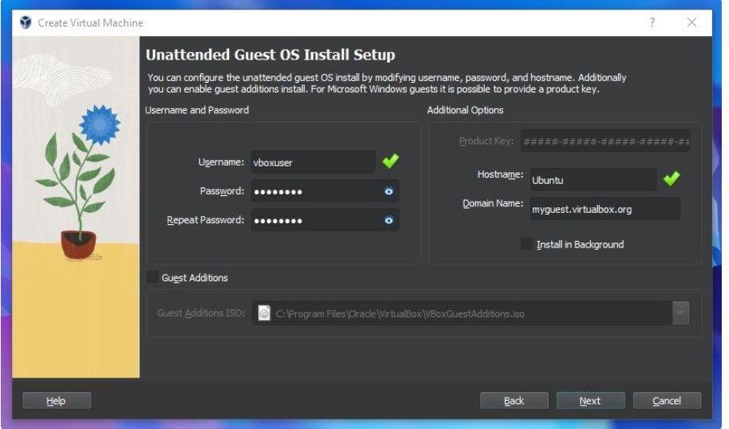
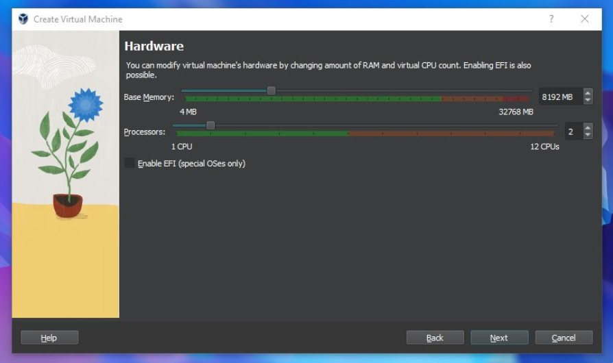
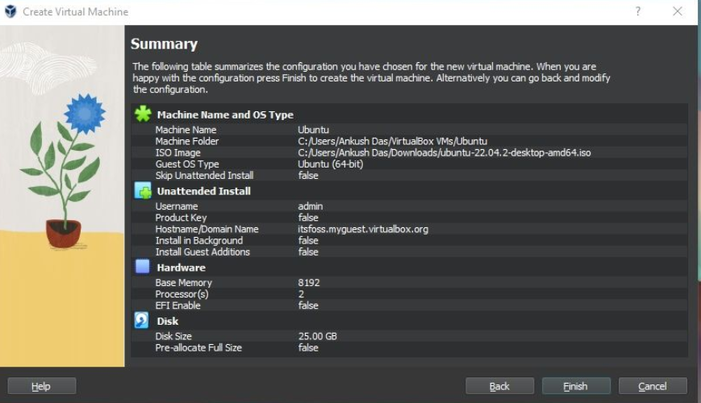
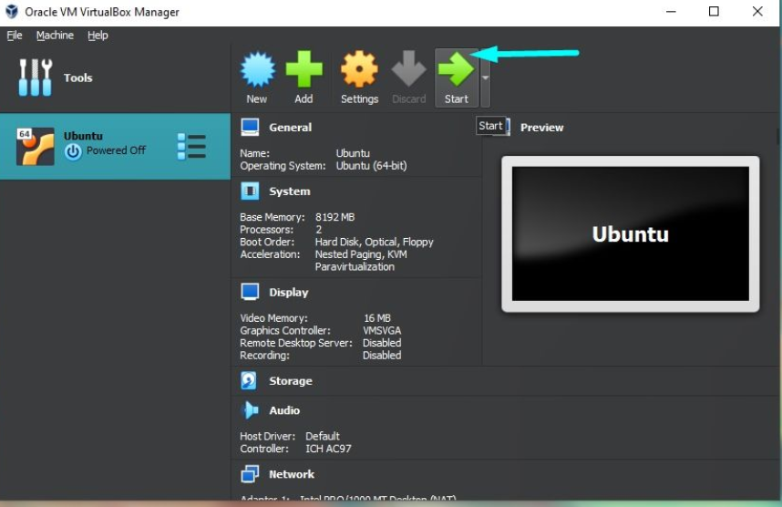

# OS-EX.2-INSTALLATION-OF-OS---CASE-STUDY

# AIM:
To install an operating system using virtual box.

# PROCEDURE:

1.Download and install virtual box from the website of oracle virtual box.

2.Download the linux ISO from the linux distribution from its official site.

3.Install linux using virtual box.

4.Start VirtualBox, and click on the New symbol to create a virtual machine.

5.It should let you write a name, and the select the ISO. The rest of the things should be automatically set.

6.For Ubuntu, VirtualBox supports creating a username, password, and specifying the hostname. You can decide to customize it or go with the defaults.

7.Next, you need to allocate memory and the CPU to help run the virtual machine.It is recommended to allocate half of what your system offers. Suppose you have 16 Gigs of RAM, you can allocate 8 to the virtual machine.

8.Now the virtual disk. This serves as the hard disk of the virtual Linux system. It is where the VM will store its files.Go with the defaults. If you have too much of less virtual hard disk space, the Linux distro might not install.

9.You will be now shown a summary of all your selections, and then it is time to launch and initiate installing the Linux OS as a virtual machine.

10.Once everything is in place, it’s time to boot that ISO and install Linux as a virtual operating system.

# RESULT:
Hence the OS is successfully installed and set up using virtual box.